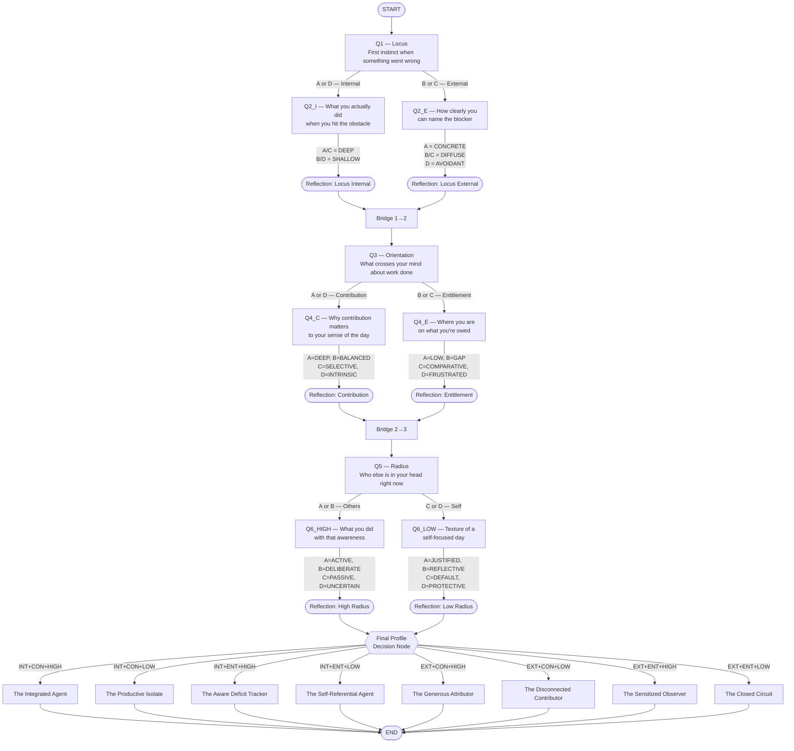

# Reflection Tree — Branching Diagram



---

## Node count

| Type | Count |
|------|-------|
| start | 1 |
| question | 6 |
| decision | 1 (final routing) |
| reflection | 6 |
| bridge | 2 |
| summary | 8 |
| end | 1 |
| **Total** | **25** |

---

## All possible conversation paths

Every session traverses exactly 6 questions. The path is:

```
START → Q1 → [Q2_I or Q2_E] → REFLECT_LOCUS → BRIDGE_1_2
     → Q3 → [Q4_C or Q4_E] → REFLECT_ORIENT → BRIDGE_2_3
     → Q5 → [Q6_HIGH or Q6_LOW] → REFLECT_RADIUS
     → DECISION_FINAL → [one of 8 SUMMARY nodes] → END
```

Total distinct full paths: **2³ = 8 terminal profiles × 4 option combinations per question = 4096 unique answer sequences**, all mapping into 8 profile keys.

---

## Depth modifier overlay

Depth tags are stored at Q2, Q4, and Q6 and appended to the summary output post-render. They do not change the branching path — only the modifier text appended to the final profile.
